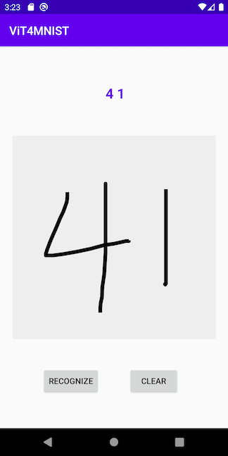
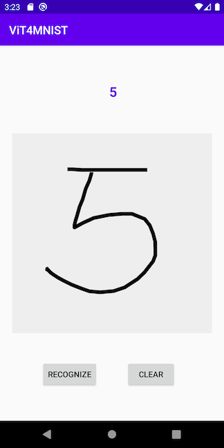
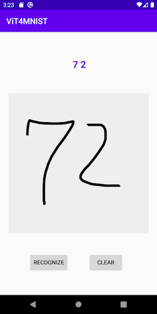

# Vision Transformer on Android

## Introduction

We use 2 well known vision models:

1. [Facebook DeiT](https://github.com/facebookresearch/deit) model, a ViT model pre-trained on ImageNet, for image classification on Android;

2. [ViT model on MNIST](https://towardsdatascience.com/a-demonstration-of-using-vision-transformers-in-pytorch-mnist-handwritten-digit-recognition-407eafbc15b0) and convert it to TorchScript to use on Android for handwritten digit recognition.

## Prerequisites

* PyTorch 1.7 or later (Optional)
* Python 3.8 (Optional)
* Android Pytorch library 1.7 or later
* Android Studio 4.0.1 or later

## Quick Start on Using Facebook DeiT

### 1. Prepare the Model (Optional)

To use a pre-trained Facebook DeiT model and convert it to TorchScript, first install [PyTorch](https://pytorch.org/get-started/locally/) 1.7 or later, then install [timm](https://github.com/rwightman/pytorch-image-models) using `pip install timm==0.3.2`, and finally run the following script:

```py
python convert_deit.py
```

This will generate the quantized scripted model named `fbdeit.pt`, which can also be downloaded [here](https://drive.google.com/file/d/1CN5BCYPh78uT2GCEobcOMtk5HSX3qe1x/view?usp=sharing). Note that the quantization code in the script reduces the model size from 346MB to 89MB.

To train and convert your own DeiT model on ImageNet, first follow the instructions under Data Preparation and Training at the [DeiT repo](https://github.com/facebookresearch/deit), then simply run the following code after `model` is trained:

```py
from torch.utils.mobile_optimizer import optimize_for_mobile
ts_model = torch.jit.script(model)
optimized_torchscript_model = optimize_for_mobile(ts_model)
optimized_torchscript_model.save("fbdeit.pt")
```

### 2. Run the Model on Android

Changes in `MainActivity.java` file from:

```py
module = Module.load(assetFilePath(this, "model.pt"))
```
to
```py
module = Module.load(assetFilePath(this, "fbdeit.pt"))
```

Run the app in Android Studio and you'll see the same image classification result.

## Quick Start on Using ViT for MNIST

To Test Run the Android ViT4MNIST demo app, follow the steps below:

### 1. Prepare the Model (Optional)

On a Terminal, with PyTorch 1.7.0 and [einops](https://pypi.org/project/einops/) installed, run :

```py
python mnist_vit.py
```


### 2. Build and run with Android Studio

Run on your AVD or real Android device.




